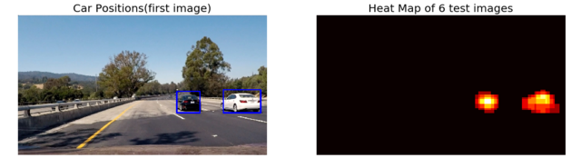
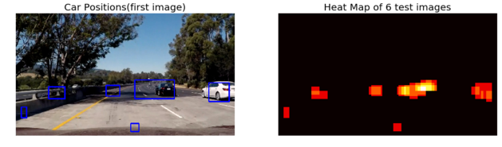
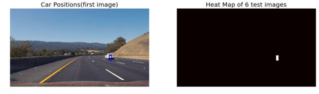

**Vehicle Detection Project**

The goals / steps of this project are the following:

* Perform a Histogram of Oriented Gradients (HOG) feature extraction on a labeled training set of images and train a classifier Linear SVM classifier
* Optionally, you can also apply a color transform and append binned color features, as well as histograms of color, to your HOG feature vector. 
* Note: for those first two steps don't forget to normalize your features and randomize a selection for training and testing.
* Implement a sliding-window technique and use your trained classifier to search for vehicles in images.
* Run your pipeline on a video stream (start with the test_video.mp4 and later implement on full project_video.mp4) and create a heat map of recurring detections frame by frame to reject outliers and follow detected vehicles.
* Estimate a bounding box for vehicles detected.

### Implementation
My implementation is in 'vehicle_detection.ipynb'.

---

### Visualizing Dataset

I have started from visualizing datasets to see which feature(side) my SVM will classify. As the visualization, my classifier will see back-side of vehicles mostly and left-side a bit.

### Histogram of Oriented Gradients (HOG)

#### 1. Explain how (and identify where in your code) you extracted HOG features from the training images.

I have seperated hog extraction functions in two ways. The one for visualization processes hog only in gray scale, and the other for extracting features does hog in all the channels of input images. The code is in the section '1.2. HOG Features' of the my implementation, 'vehicle_detection.ipynb'.

    def get_hog_features(img, orient, pix_per_cell, cell_per_block, 
                            vis=False, feature_vec=True):
        if vis == True:
            # do hog only for gray scale to visualize
            hog_img = cv2.cvtColor(img, cv2.COLOR_RGB2GRAY)
            features, hog_image = hog(hog_img, orientations=orient, pixels_per_cell=(pix_per_cell, pix_per_cell),
                                      cells_per_block=(cell_per_block, cell_per_block), block_norm= 'L2-Hys',
                                      transform_sqrt=True, 
                                      visualise=vis, feature_vector=feature_vec)
            return features, hog_image
        else:
            # do hog for every channel to extract real features
            features=[]
            hog_img = img[:,:,0]
            hog_features = hog(hog_img, orientations=orient, pixels_per_cell=(pix_per_cell, pix_per_cell),
                           cells_per_block=(cell_per_block, cell_per_block), block_norm= 'L2-Hys',
                           transform_sqrt=True, 
                           visualise=vis, feature_vector=feature_vec)
            features=hog_features
            hog_img = img[:,:,1]
            hog_features = hog(hog_img, orientations=orient, pixels_per_cell=(pix_per_cell, pix_per_cell),
                           cells_per_block=(cell_per_block, cell_per_block), block_norm= 'L2-Hys',
                           transform_sqrt=True, 
                           visualise=vis, feature_vector=feature_vec)
            features=features+hog_features
            hog_img = img[:,:,2]
            hog_features = hog(hog_img, orientations=orient, pixels_per_cell=(pix_per_cell, pix_per_cell),
                           cells_per_block=(cell_per_block, cell_per_block), block_norm= 'L2-Hys',
                           transform_sqrt=True, 
                           visualise=vis, feature_vector=feature_vec)
            features=features+hog_features
        return features

Then, I Have tested various values for parameters of 'orientation, pixels_per_cell, cells_per_block' and the color space. Finally, I have chosend the parameters like the below, mainly based on 'how can classifyer recude false-positive'. Since I've found that my classifier can achieve around 98% of accuracy with small variance of accuracy with regard to the parmeters, I've just chosen parameters to minimize false-positivie impirically testing on images with linear SVM classifier in the following section. 

    orient = 11
    pix_per_cell = 8
    cell_per_block = 2

And, for the color space, I have found that 'RGB' showed best accuracy of SVM, so that I've always applied 'RGB' to extracting HOG features.

Here is my visualization of HOG features:

(More examples in my implementation file, 'vehicle_detection.ipynb')

#### 2. Explain how you settled on your final choice of HOG parameters.

Mostly explained above. 

#### 3. More Features : Color Histogram and Spatial bins

I have applied 'Color Histogram and Spatial bins' to extra features as learned in lessons.  I did not visualize spatial features because it is very clear, nothing more than resizing, and only visualized Color Histogram features, like below :

#### 4. Describe how (and identify where in your code) you trained a classifier using your selected HOG features (and color features if you used them).

I trained a linear SVM using features from HOG, Spatial bins and Color Histogram. 

In the section '1.5. Combined and Extract Features' of my implementation, I have extracted features each for HOG, Spatial bins and Color Histogram including changing color space, and concatenateded them to one linear feature shape. 

    def extract_features(rgb_img, hog=True, spatial_bin=True, histogram=True, \
                        color_space='RGB', \
                        orient = 9, pix_per_cell = 8, cell_per_block = 2, \
                        spatial_size=(32,32), \
                        nbins=32):
        # Color space conversion for histogram and spatial bin
        if color_space != 'RGB':
            if color_space == 'HSV':
                f_img = cv2.cvtColor(rgb_img, cv2.COLOR_RGB2HSV)
            elif color_space == 'LUV':
                f_img = cv2.cvtColor(rgb_img, cv2.COLOR_RGB2LUV)
            elif color_space == 'HLS':
                f_img = cv2.cvtColor(rgb_img, cv2.COLOR_RGB2HLS)
            elif color_space == 'YUV':
                f_img = cv2.cvtColor(rgb_img, cv2.COLOR_RGB2YUV)
            elif color_space == 'YCrCb':
                f_img = cv2.cvtColor(rgb_img, cv2.COLOR_RGB2YCrCb)
        else: f_img = np.copy(rgb_img)      
            
        # HOG Features , always done in RGB space
        if hog==True:
            hog_features =  get_hog_features(f_img, orient, pix_per_cell, cell_per_block, 
                                             vis=False, feature_vec=True)
            
            
        if spatial_bin==True:
            spatial_features = bin_spatial(f_img, size=spatial_size)
        if histogram == True:
             # Apply color_hist()
            hist_features = color_hist(f_img, nbins=nbins)
        features = np.hstack([hog_features, spatial_features, hist_features])
        return features

Then, proceded extracting features and saved to use as train dataset.

    #####
    # Parameters for feature extraction
    use_hog=True
    use_spatial_bin=True
    use_histogram=True
    color_space='LUV'
    orient = 11
    pix_per_cell = 8
    cell_per_block = 2
    spatial_size=(16,16)
    histogram_nbins=32
    #####
    # Extract Features
    train_features = []
    for img in train_img:
        train_features.append(extract_features(img, use_hog, use_spatial_bin, use_histogram,\
                                              color_space, \
                                              orient, pix_per_cell, cell_per_block, \
                                              spatial_size, \
                                              histogram_nbins))
    train_features = np.asarray(train_features, np.float64)

After that, I have seperated features into trainset and testset, including radomizing.

    #####
    # Spliting data into training and test sets, and randomize
    random_state=random.randint(1, 100) 
    from sklearn.model_selection import train_test_split
    X_train, X_test, y_train, y_test = train_test_split(train_features, train_label, test_size=0.2, random_state=random_state)

Then, normalized trainset with StandardScaler(), and applied the normalizer to both trainset and testset.

    #####
    # Scaler set-up to normalize train dataset
    from sklearn.preprocessing import StandardScaler
    X_scaler = StandardScaler().fit(X_train)
    # Apply the scaler to X
    X_train = X_scaler.transform(X_train)
    X_test = X_scaler.transform(X_test)

With normalized trainset and testset, I have fit the linear SVM model, and get the accuracy, '97.66'.

    #####
    # Use a linear SVC 
    from sklearn.svm import LinearSVC
    svc = LinearSVC()
    # Check the training time for the SVC
    svc.fit(X_train, y_train)

    Train set size : 14208
    Test set size : 3552
    Test Accuracy of SVC =  0.9806

One thing strange results are that getting higher accuracy does not guarantee good performance in small sizes. I think that random cropping and resizing to the trainset may help to achieve better robustness in sizes. 

### Sliding Window Search

#### 1. Describe how (and identify where in your code) you implemented a sliding window search.  How did you decide what scales to search and how much to overlap windows?

I decided to search window positions lineary, with various sizes of boxes, in the bottom half of the image and came up with this :

(Applied two sizes in the following on test time, but here, only visualized one of the boxes(64,64) to see whether it works proper. )

#### 2. Show some examples of test images to demonstrate how your pipeline is working.  What did you do to optimize the performance of your classifier?

Ultimately I searched on three scales using RGB 3-channel HOG features plus spatially binned color and histograms of color in the feature vector, which provided good results.  However it was very sensitive to the threshold of heatmap count. I have visualized the results with heatmap threashold '1' :

In the below image, there were too many false positives.

In the below, too small size of detection found. 

To recover the variance from threshold, I have decided to apply a method of tracking by multiple images, where I have stacked results from a few sequential images, then sets threshold bigger. This helped to reduce false positives.

---

### Video Implementation

#### 1. Provide a link to your final video output.  Your pipeline should perform reasonably well on the entire project video (somewhat wobbly or unstable bounding boxes are ok as long as you are identifying the vehicles most of the time with minimal false positives.)
Here's a [link to my video result](./output_images/output_video.mp4)

#### 2. Describe how (and identify where in your code) you implemented some kind of filter for false positives and some method for combining overlapping bounding boxes.

To recover the variance from threshold, I have applied a method of tracking by multiple images, where I have stacked results from a few sequential images, then sets threshold bigger. This helped to reduce false positives.

First of all, I have stacked the results to the variable 'saved_box' frame by frame with some limits of number of frames:

    if frame_count>stack_threshold:
        saved_box_list.pop(0)
    if(len(detect_windows)==0):
        detect_windows=np.zeros([1,2,2])
    saved_box_list.append(detect_windows)

Then, I collect all the boxes of 'saved_box', to 'box_list':

    box_list=np.empty([0,2,2])
    for box in saved_box_list:
        box_list = np.vstack((box_list, box))
    
 
Finally I have applied big threashold to my heatmap. :

    # Apply threshold to help remove false positives
    heat = apply_threshold(heat,10)

I have stacked boxes from '5' frames, and thresholded with '10'. I still need to tune more for the number of frames and threshold value.

---

### Discussion

#### 1. Briefly discuss any problems / issues you faced in your implementation of this project.  Where will your pipeline likely fail?  What could you do to make it more robust?

As images results, my classifier is very sensitive to the brightness of image and the size of object. I think that I need to apply data augmentation to my dataset and preprocessing to input images, then, I can get more robust classifier. Moreover, if I use deep-convolution network to extract features, it may help to improve detection performance.
For more, I strongly expect that tracking with filters like extended Kalman will greatly improve the tracking results.
